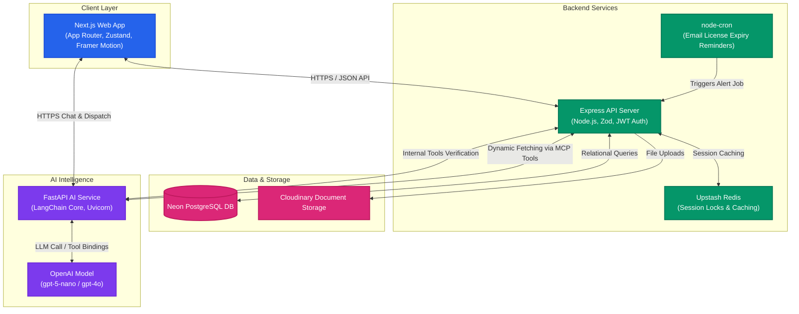
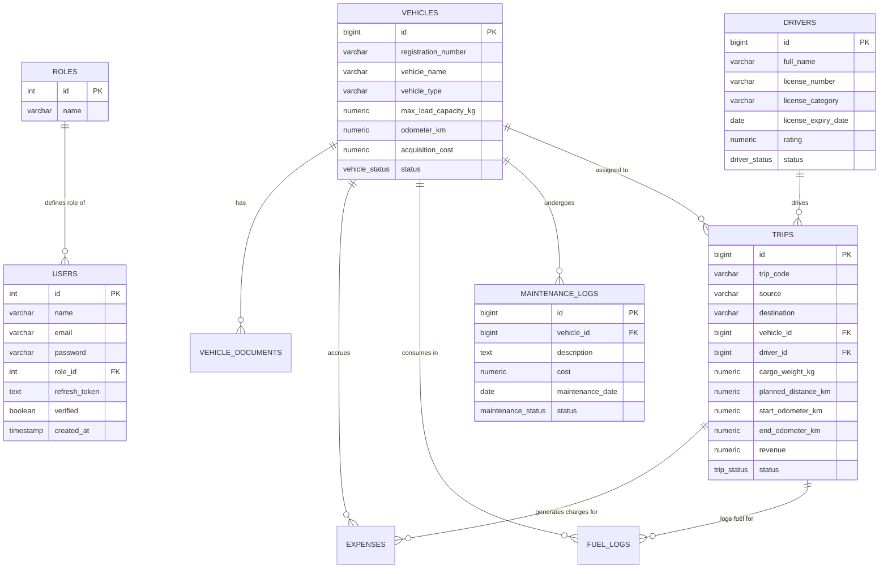
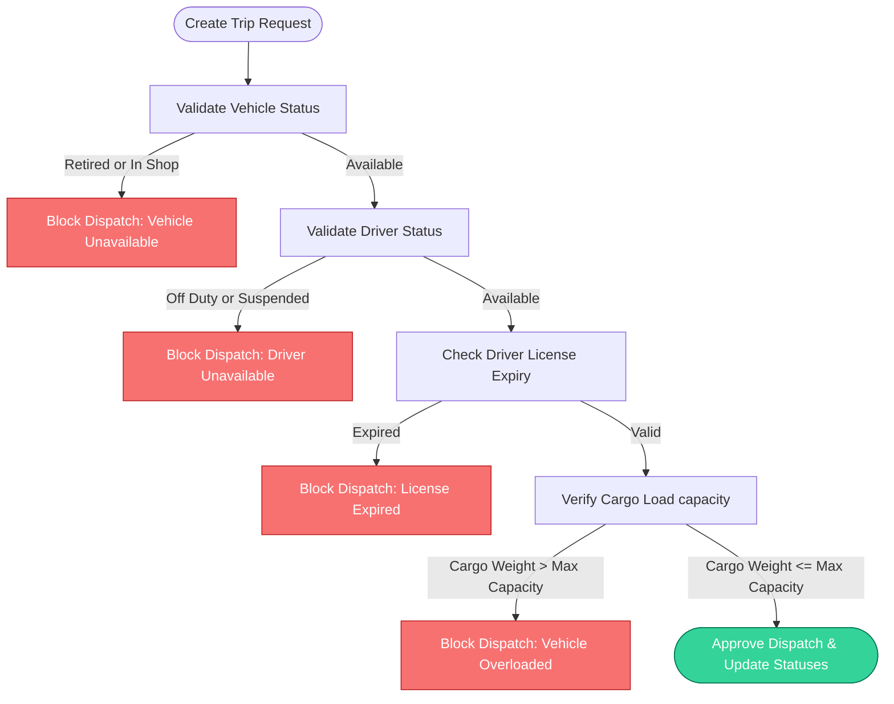

# TransitOps – Smart Transport Operations Platform

TransitOps is a centralized, enterprise-grade **Transport Operations Platform** designed to digitize and streamline fleet management for modern logistics organizations. The system replaces fragile, spreadsheet-based workflows with a highly governed, automated web application that seamlessly manages vehicles, drivers, trips, maintenance logs, fuel consumption, operational expenses, and AI-driven dispatch optimization.

The objective is to provide a single source of truth for transport operations while enforcing strict business rules, reducing manual errors, improving fleet utilization, and providing operational insights through dashboards and reports.

---

## 📖 Table of Contents
1. [Problem Statement](#-problem-statement)
2. [Project Objective](#-project-objective)
3. [Target Users & RBAC Matrix](#-target-users--rbac-matrix)
4. [System Architecture](#-system-architecture)
5. [Entity Relationship Diagram](#-entity-relationship-diagram)
6. [Core Modules & Functional Specifications](#-core-modules--functional-specifications)
7. [Mandatory Business Rules & Operational Validations](#-mandatory-business-rules--operational-validations)
8. [Automated State Lifecycles](#-automated-state-lifecycles)
9. [Dashboard KPIs & Analytical Reports](#-dashboard-kpis--analytical-reports)
10. [Setup & Configuration Guide](#-setup--configuration-guide)
11. [Deployment Guide](#-deployment-guide)

---

## 🚨 Problem Statement

Many logistics companies still manage their transportation operations manually using legacy tools like spreadsheets, paper registers, and physical logs. This leads to severe operational inefficiencies:

* **Scheduling Conflicts**: Double booking of vehicles or drivers occurs frequently.
* **Underutilized Fleet**: Lack of unified status reports leaves vehicles idle.
* **Missed Maintenance**: No automated tracking leads to breakdowns and high repair costs.
* **Compliance Risks**: Expired driver licenses or suspended credentials go unnoticed, risking safety fines.
* **Inaccurate Accounting**: Fuel slips and trip expenses are lost or miscalculated.
* **Lack of Visibility**: Managers cannot view real-time fleet utilization or profitability reports.

TransitOps resolves these issues by consolidating all transportation records into a single, rule-governed database.

---

## 🎯 Project Objective

Develop a responsive web application that enables organizations to manage the complete lifecycle of transportation operations:
* **Asset Registry**: Track vehicle profiles, purchase costs, and odometer readings.
* **Staff Management**: Monitor driver compliance, ratings, and license validities.
* **Workflow Automation**: Build status-aware dispatching systems that auto-assign assets.
* **Cost Governance**: Log fuel, tolls, and maintenance expenditures.
* **Actionable Analytics**: Display real-time fleet efficiency, vehicle ROI, and operations dashboards.

---

## 👥 Target Users & RBAC Matrix

The system provides targeted access controls based on organizational roles:

### 1. Fleet Manager
* **Goal**: Maximize fleet uptime and lifecycle efficiency.
* **Responsibilities**: Register and edit vehicles, monitor status distribution, log maintenance schedules, view asset ROI.

### 2. Dispatcher
* **Goal**: Plan, schedule, and launch deliveries on time.
* **Responsibilities**: Create and draft trips, assign compliant vehicles and drivers, dispatch trips, and monitor active deliveries.

### 3. Safety Officer
* **Goal**: Enforce regulatory compliance and driver safety.
* **Responsibilities**: Add and edit driver profiles, track license expiry dates, monitor safety ratings, block unsafe or non-compliant drivers.

### 4. Financial Analyst
* **Goal**: Audit operational expenditures and profit margins.
* **Responsibilities**: Track fuel transactions, approve operational invoices and trip costs, export CSV reports, view vehicle profitability logs.

---

### 🔐 Role Permission Matrix

| Module / Screen | Fleet Manager | Dispatcher | Safety Officer | Financial Analyst |
| :--- | :---: | :---: | :---: | :---: |
| **Dashboard** | 👁️ View | 👁️ View | 👁️ View | 👁️ View |
| **Vehicles Registry** | 🛠️ CRUD | 👁️ View | 👁️ View | 👁️ View |
| **Driver Management** | 👁️ View | 👁️ View | 🛠️ CRUD | 👁️ View |
| **Trip Dispatching** | 👁️ View | 🛠️ CRUD | 👁️ View | 👁️ View |
| **Maintenance** | 🛠️ CRUD | 👁️ View | 👁️ View | 👁️ View |
| **Fuel Logging** | 👁️ View | 👁️ View | 👁️ View | 🛠️ CRUD |
| **Expense Tracking** | 👁️ View | 👁️ View | 👁️ View | 🛠️ CRUD |
| **Reports & Analytics** | ✅ Read & Export | 👁️ View | 👁️ View | ✅ Read & Export |
| **Settings & RBAC** | ✅ Full Access | ❌ Restricted | ❌ Restricted | ❌ Restricted |

---

## 🏗️ System Architecture

TransitOps is constructed as a decoupled, multi-service platform:



---

## 🗄️ Entity Relationship Diagram

The underlying schema ensures absolute integrity through foreign key relations and cascade mechanics:



---

## 📂 Core Modules & Functional Specifications

### 1. Authentication & Session Gateway
* **Secure Flow**: Password-based signup and login secured using `bcrypt` and signed JWT tokens.
* **Security Mechanics**: Token pairs (Access and Refresh) allow seamless re-auth while guarding endpoints.
* **RBAC Route Guards**: The frontend router reads the active session and denies rendering pages not permitted by the user's role.

### 2. Operational Dashboard
* **Dynamic KPIs**: Instant counter tiles indicating active trucks, available drivers, pending trips, and overall fleet utilization percentage.
* **Quick Filters**: Dynamically slice metrics by vehicle type, status, and target logistics region.
* **Visual Feeds**: Lists the latest ongoing trips and status changes as they are saved in the database.

### 3. Vehicle Registry
* **Asset Tracking**: Register vehicles with unique license plates, type specifications, odometer readings, and initial acquisition costs.
* **Lifecycle States**: Track statuses (`AVAILABLE`, `ON_TRIP`, `IN_SHOP`, `RETIRED`).
* **Document Locker**: Upload and verify digital assets (registration cards, permits) linked to the vehicle, stored on Cloudinary.

### 4. Driver Registry
* **Compliance Checks**: Safety Officers add drivers, record license classes, and log mandatory license expiry dates.
* **Driver Ratings**: Safety scores (0–100) are updated based on post-trip incident reports.
* **Statuses**: Map availability (`AVAILABLE`, `ON_TRIP`, `OFF_DUTY`, `SUSPENDED`).

### 5. Trip Management & Dispatch Dispatcher
* **Dispatch Configurator**: Specify cargo load, starting location, target destination, planned routes, and client revenue.
* **Safety Lockouts**: The dispatcher interface filters out busy, suspended, or uncertified drivers and busy vehicles during selection.

### 6. Maintenance Management
* **Workshop Loggers**: Fleet managers put vehicles in shop, registering workshop dates, diagnostic descriptions, and target expenses.
* **Automation**: Setting maintenance status to `ACTIVE` automatically locks the vehicle state to `IN_SHOP`.

### 7. Fuel & Expense Accounting
* **Expense Loggers**: Log liters refueled, per-trip toll receipts, and repair costs.
* **Trip Matching**: Expenses link to active trip IDs to calculate exact margins and profitability indices.

---

## 🛡️ Mandatory Business Rules & Operational Validations

TransitOps prevents manual scheduling errors and compliance failures by enforcing strict backend constraints during trip dispatching:



---

## 🔄 Automated State Lifecycles

### Trip Status Automations
* **Dispatching a Trip**: Translates the selected vehicle and driver statuses automatically:
  $$\text{Vehicle Status}: \text{AVAILABLE} \rightarrow \text{ON\_TRIP}$$
  $$\text{Driver Status}: \text{AVAILABLE} \rightarrow \text{ON\_TRIP}$$
* **Completing a Trip**: Updates ending odometers, records revenues, and restores asset availability:
  $$\text{Vehicle Status}: \text{ON\_TRIP} \rightarrow \text{AVAILABLE}$$
  $$\text{Driver Status}: \text{ON\_TRIP} \rightarrow \text{AVAILABLE}$$
* **Cancelling a Dispatched Trip**: Safely resets the assigned assets:
  $$\text{Vehicle Status} \rightarrow \text{AVAILABLE}$$
  $$\text{Driver Status} \rightarrow \text{AVAILABLE}$$

### Maintenance State Automations
* **Active Maintenance Record**:
  $$\text{Vehicle Status}: \text{AVAILABLE} \rightarrow \text{IN\_SHOP}$$
* **Closing Maintenance**:
  $$\text{Vehicle Status}: \text{IN\_SHOP} \rightarrow \text{AVAILABLE}\quad (\text{unless vehicle is Retired})$$

---

## 📈 Dashboard KPIs & Analytical Reports

The financial analytics module automatically calculates operational indicators:

$$\text{Fleet Utilization (\%)} = \left( \frac{\text{Vehicles Currently On Trip}}{\text{Total Fleet Size}} \right) \times 100$$

$$\text{Fuel Efficiency} = \frac{\text{Distance Travelled (km)}}{\text{Fuel Consumed (Litres)}}$$

$$\text{Total Operational Cost} = \text{Fuel Costs} + \text{Maintenance Costs} + \text{Other Expenses}$$

$$\text{Vehicle ROI} = \frac{\text{Revenue} - (\text{Fuel Cost} + \text{Maintenance Cost})}{\text{Vehicle Acquisition Cost}}$$

* **Exports**: Features mandatory CSV reports containing filtered datasets for offline spreadsheet audits.

---

## ⚡ Setup & Configuration Guide

### 📋 Prerequisites
* **Node.js**: v18 or higher
* **Python**: v3.10 or higher
* **PostgreSQL**: Neon DB connection string or local instance
* **Redis**: Upstash Redis URL or local instance

### 🔑 Environment Configurations

#### Backend Server (`/backend/.env`)
```ini
PORT=8000
DATABASE_URL=postgresql://<user>:<password>@<host>/<dbname>?sslmode=require
JWT_SECRET=<secure_secret>
REFRESH_TOKEN=<secure_secret>
REDIS_URL=rediss://default:<password>@<redis_host>:6379
SMTP_HOST=smtp.gmail.com
SMTP_PORT=587
SMTP_USER=<gmail_user>
SMTP_PASS=<app_password>
SMTP_FROM=<from_email>
INTERNAL_API_SECRET=transitops-internal
AI_SERVICE_URL=http://localhost:8001
```

#### Frontend Client (`/frontend/.env.local`)
```ini
NEXT_PUBLIC_API_URL=http://localhost:8000
NEXT_PUBLIC_AI_API_URL=http://localhost:8001
```

#### AI Service (`/ai/.env`)
```ini
OPENAI_API_KEY=sk-proj-...
BACKEND_URL=http://localhost:8000
INTERNAL_API_SECRET=transitops-internal
OPENAI_MODEL=gpt-5-nano
```

### 🚀 Running the Platform

1. **Start the PostgreSQL Schema**:
   * Execute the database migration scripts inside `backend/schema.sql` on your target database.

2. **Run Backend Service**:
   ```bash
   cd backend
   npm install
   npm run dev
   ```

3. **Run AI Python Service**:
   ```bash
   cd ai
   # Activate your virtual environment
   venv\Scripts\activate  # Windows
   source venv/bin/activate  # macOS/Linux
   pip install -r requirements.txt
   python main.py
   ```

4. **Run Frontend Client**:
   ```bash
   cd frontend
   npm install
   npm run dev
   ```

Open [http://localhost:3000](http://localhost:3000) to view the client application in your browser.

---

## ☁️ Deployment Guide

### Backend (Vercel)
The backend is optimized for Vercel Serverless Functions using the root [`vercel.json`](./backend/vercel.json) rewrite rule:
1. Connect your repo to Vercel.
2. Set the root directory to `backend`.
3. Add all variables from `backend/.env` into Vercel settings.
4. Ensure `export default app;` remains at the bottom of `server.js`.

### AI Service (Render)
1. Create a new **Web Service** on Render.
2. Root directory: `ai`.
3. Build Command: `pip install -r requirements.txt`.
4. Start Command: `uvicorn main:app --host 0.0.0.0 --port $PORT`.
5. Add `OPENAI_API_KEY`, `OPENAI_MODEL`, `BACKEND_URL`, and `INTERNAL_API_SECRET` to the environment settings.

### Frontend (Vercel)
1. Deploy Next.js using default presets.
2. Root directory: `frontend`.
3. Set `NEXT_PUBLIC_API_URL` to your production backend URL.
